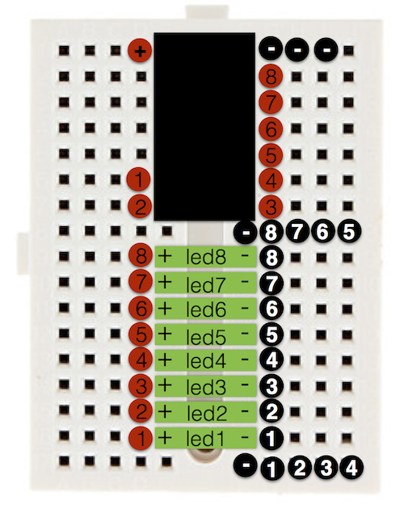

# attiny-pov

A low-cost persistence-of-vision toy on a breadboard with an Atmel attiny44a MCU.

The result could look like this:

(picture courtesy of KLB)

# Bil of materials

Each toy is built from the following components:

- Atmel AVR Attiny44a MCU
- 8 LEDs
- 8 220 Ohm resistors
- a 170 point breadboard
- a battery holder (with leads)
- 2 AA batteries
- AVG wire to connect everything

The cost of each toy is about 6 EUR.
The resulting toys can be seen [here](https://twitter.com/joostd/status/682868528966418432)

Also needed is a programmer. I am using an arduino as a programmer (i.e. `ArduinoISP.ino`).

Refer to the attiny44's [pinout](http://42bots.com/wp-content/uploads/2014/01/ATTiny84-ATTiny44-pinout.png) and where to connect the [SPI wires](http://orig06.deviantart.net/82c9/f/2013/038/3/7/attiny_web_by_pighixxx-d5u4aur.png).

See also this [tutorial](http://highlowtech.org/?p=1706).

# Assembly

- put the attiny44 IC with pin1 in point E1
- for each LED, connect its cathode with its corresponding port A pin (i.e. pins 6,7,8,9,10,11,12,13)
- connect each LED's anode with a resistor
- connect each resistor with ground
- connect your battery's + with pin 1
- conect your battery's - with pin 14

You should have some blinking lights. Wave!

A possible layout looks like this:

Here, I have numbered each led (green), wire (red), and resistor (black).
The (-) points should also be connnected, to have additional ground points for the resistors.

# tools

To modify the message displayed with the pov toy you will need to compile and flash new firmware for the avrtiny44.

## osx

Install the avr-gcc compiler tools. They are installed with the [Arduino IDE](https://www.arduino.cc/en/Main/Software), or install them from [CrossPack](https://www.obdev.at/products/crosspack/index.html), or using [brew](http://brew.sh)

## linux

avr-gcc and avrdude can be installed from packages, eg on debian:

	apt-gt install avr-gcc avrdude

### Using a raspberry pi

On a raspberry, the GPIO pins can be used to program the avrtiny44. Refer to the Pi's [pinout](http://pinout.xyz/pinout/arduino_spi).

You may need a modified avrdude. See the discussion on the [GertBoard](https://projects.drogon.net/raspberry-pi/gertboard/arduino-ide-installation-isp/).

## Compiling

Type

	make

to compile the file `pov.c` into the file `pov.hex`.

## Flashing

Type

	make flash

to write the file `pov.hex` into the attiny44's flash memory.

# Other POVs

- http://shrimping.it/blog/persistence-of-vision/
- https://learn.adafruit.com/minipov3
